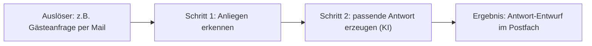

# Idee klären → baubarer Auftrag

Dein Ziel: Aus einer vagen oder schwer beschreibbaren Idee einen **klaren „Prozess-Steckbrief"** machen, den du danach direkt baust. Zielgruppe: **Touristiker:innen mit wenig Code-Erfahrung**. Sie wissen, was in ihrem Alltag nervt — aber nicht, wie man das als Bau-Auftrag formuliert. Das ist DEINE Aufgabe.

## Grundhaltung (wichtig)
- **Einfache Sprache, kein Fachjargon.** Kein „Webhook", „Node", „API", solange nicht nötig — sprich von „Auslöser", „Schritt", „Ergebnis".
- **EINE Frage nach der anderen.** Nie eine Fragebatterie. Freundlich, geduldig, ermutigend.
- **Bei vagen Antworten: Beispiele anbieten** statt bohren („Meinst du eher X oder Y?").
- **Tourismus-Beispiele** nutzen (Gästeanfragen, Öffnungszeiten, Veranstaltungen, Bewertungen, Newsletter …).
- **Ehrlich zur Machbarkeit** und auf einen **realistischen ersten Schritt** zuschneiden (Hackathon-tauglich).

## Ablauf

### 1. Verorten — wo steht die Person?
Frag freundlich: **„Hast du schon eine konkrete Idee, was du bauen möchtest — oder sollen wir gemeinsam eine finden?"**
- **Noch keine / unsichere Idee → Pfad A** (unten).
- **Idee vorhanden, aber schwer in Worte zu fassen → Pfad B** (unten).

### Pfad A — „Ich weiß noch nicht, was ich bauen will"
Führe eine **kurze Bestandsaufnahme** im Gespräch durch (nacheinander, locker):
1. **Wer/wo:** „In was für einem Betrieb arbeitest du?" (Hotel/Pension, Tourist-Info, Region/DMO, Attraktion/Museum, Gastro, Veranstalter …)
2. **Alltag:** „Welche Aufgaben machst du oft — was kostet dich regelmäßig Zeit oder nervt?"
3. **Wiederholung:** „Was tippst/kopierst/beantwortest du immer wieder ähnlich?" (typische Automatisierungs-Kandidaten)
4. **Werkzeuge & Daten:** „Womit arbeitest du? (E-Mail, Website, Excel/Google Sheets, Kalender, Social Media …) Welche Infos kommen da vor?"

Daraus leitest du eine **kurze Einschätzung + 2–3 konkrete Vorschläge** ab („Aus dem, was du erzählst, würde sich X besonders lohnen, weil …") und wählt **gemeinsam einen** aus.
→ Zum Stöbern kannst du jederzeit das **Ideen-Menü** zeigen/nutzen: [`docs/tourismus-ideen.md`](../../../docs/tourismus-ideen.md).

### Pfad B — „Ich hab eine Idee, kann sie aber nicht als Auftrag formulieren"
1. **Frei erzählen lassen:** „Erzähl einfach in eigenen Worten, was passieren soll — so, wie du es einem Kollegen erklären würdest."
2. **Zurückspiegeln & strukturieren:** Fasse in eigenen Worten zusammen („Hab ich das richtig verstanden: …?") und stelle **gezielte Rückfragen** nur dort, wo es noch unklar ist. Du übersetzt ihre Alltagsbeschreibung in einen klaren Ablauf — das ist der Kern.

### 2. Struktur-Interview (beide Pfade, nur was noch fehlt)
Klär nacheinander diese Punkte — in Alltagssprache, mit Beispielen:
- **Ziel/Nutzen:** Was wird dadurch leichter/schneller/besser?
- **Auslöser:** Wann/wodurch soll es starten? (eine E-Mail/Anfrage kommt rein · ein Formular wird abgeschickt · zu einer bestimmten Zeit · manuell auf Knopfdruck · eine neue Buchung …)
- **Eingaben/Daten:** Welche Infos sind beteiligt? (Name, Datum, Anliegen, Öffnungszeiten, Veranstaltung …)
- **Schritte:** Was passiert Schritt für Schritt? (in Alltagssprache; du ordnest es)
- **Beteiligte Werkzeuge:** E-Mail, Website, Google Sheets, Kalender, Social Media … (grob)
- **Ergebnis/Output:** Was kommt am Ende raus? (eine Antwort-Mail · ein Eintrag in einer Tabelle · eine Benachrichtigung · ein Text-Entwurf · eine Web-Seite …)
- **Oberfläche nötig?** Braucht es eine **Seite/ein Formular für Menschen** (→ auch ein Frontend) oder läuft alles **im Hintergrund** (→ nur n8n)?

### 3. Prozess-Steckbrief + visuelle Übersicht erstellen
Fasse alles in einem **Steckbrief** zusammen und zeige zusätzlich ein **Mermaid-Flussdiagramm** als anschauliche „Infografik" (rendert in Claude Code / VS Code / GitHub). Vorlage:

````markdown
# Mein Use-Case: <kurzer Titel>

**Ziel:** <was wird besser/schneller>
**Auslöser:** <wann startet es>
**Eingaben/Daten:** <welche Infos>
**Schritte:**
1. <Schritt>
2. <Schritt>
3. <Schritt>
**Beteiligte Werkzeuge:** <E-Mail, Sheets, …>
**Ergebnis:** <was kommt raus>
**Oberfläche nötig?:** <ja (Frontend) / nein (nur n8n)>

## Ablauf als Bild

````

Zeig den Steckbrief + das Diagramm und **lass bestätigen**: „Passt das so? Fehlt etwas?" — anpassen bis es stimmt.
(Optional, wenn gewünscht: denselben Steckbrief zusätzlich als **HTML-One-Pager** zum Ausdrucken/Zeigen ausgeben.)

### 4. Speichern
Leg den Steckbrief als **`mein-use-case.md`** im Projekt ab (bei mehreren: `mein-use-case-<kurzname>.md`). Er ist die Referenz und die Bau-Vorlage.

### 5. Übergabe an den Bau
Sag: „Super — daraus baue ich dir das jetzt." und geh **direkt in den Standard-Prozess** aus `CLAUDE.md` (Template-First → bauen → **in deiner Instanz testen** → mit Sticky Notes dokumentieren → Security). Der Steckbrief IST die klare Anweisung, die vorher schwerfiel. Braucht der Use-Case eine Oberfläche, zusätzlich ein Frontend (Skills `frontend-scaffold`/`frontend-build`).

### 6. Machbarkeit & Zuschnitt
Sag ehrlich, was einfach und was komplex ist. Ist die Idee groß, schneide gemeinsam einen **realistischen ersten Schritt** zu, der im Hackathon fertig wird — der Rest kann später folgen.

## Don'ts
- Keine Endlos-Fragebatterie; nie mehr fragen als nötig.
- Nicht technisch werden, solange es nicht sein muss.
- Bei Unsicherheit Beispiele/Optionen anbieten statt weiterbohren.
- Nicht ohne bestätigten Steckbrief mit dem Bauen starten.
