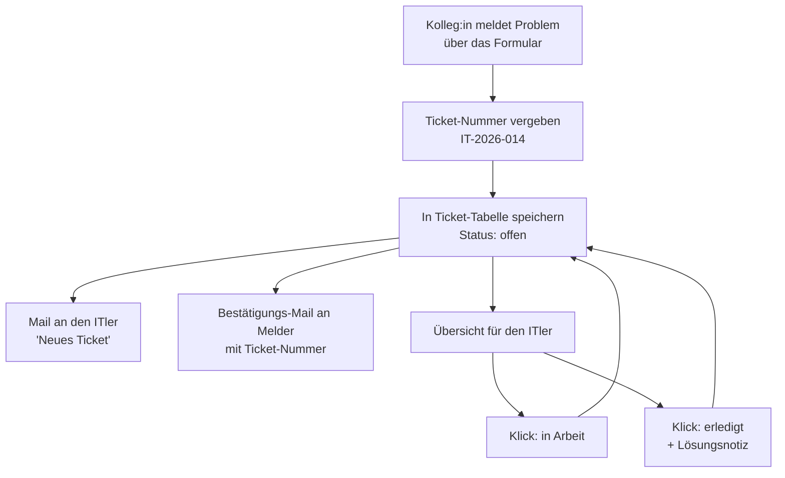

# Mein Use-Case: IT-Ticketsystem

**Ziel:** Nichts geht mehr unter. Heute kommen IT-Probleme per Mail, Anruf oder Zuruf —
niemand weiß, was offen ist. Künftig landet jede Meldung an einer Stelle, hat eine Nummer
und einen Status. Der ITler sieht auf einen Blick, was zu tun ist.

**Auslöser:** Eine Kollegin / ein Kollege füllt das Meldeformular auf einer kleinen Web-Seite aus.
(Zuruf und Anruf werden damit ersetzt: "Schreib's bitte kurz ins Formular.")

**Eingaben/Daten:**
Name, E-Mail, Abteilung/Standort, Betreff, Beschreibung des Problems,
Kategorie (Drucker, Netzwerk, Software, Zugang/Passwort, Hardware, Sonstiges),
Dringlichkeit (niedrig / normal / dringend)

**Schritte:**
1. Kolleg:in füllt das Formular aus und schickt es ab.
2. Das System vergibt automatisch eine Ticket-Nummer (z. B. `IT-2026-014`).
3. Das Ticket wird in einer Tabelle gespeichert — Status: **offen**.
4. Der ITler bekommt sofort eine E-Mail mit allen Infos und Link zur Übersicht.
5. Der Melder bekommt eine Bestätigungs-Mail mit seiner Ticket-Nummer.
6. Der ITler sieht alle Tickets in einer Übersicht und setzt sie per Klick auf
   **in Arbeit** oder **erledigt** (mit kurzer Lösungsnotiz).

**Beteiligte Werkzeuge:** n8n (Ablauf + Tabelle), E-Mail, kleine Web-Seite (Formular + Übersicht)

**Ergebnis:** Eine lebende Ticket-Liste + zwei automatische Mails pro Meldung.

**Oberfläche nötig?:** Ja — zwei Seiten:
- `/` Meldeformular für alle Kolleg:innen
- `/it` Übersicht für den ITler (filtern nach Status, abhaken)

## Ablauf als Bild

## Bewusst NICHT im ersten Schritt
- Keine KI-Einsortierung (Kategorie/Dringlichkeit wählt der Melder selbst per Auswahlfeld)
- Kein automatisches Einlesen des Mail-Postfachs
- Kein Login — die Übersicht ist über einen eigenen Link erreichbar
