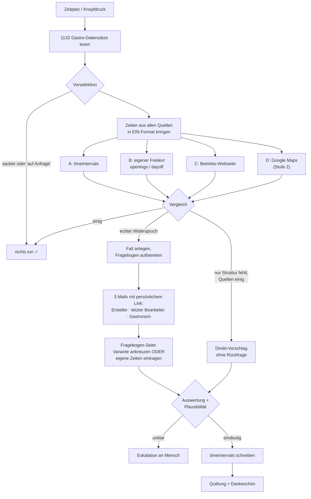

# Mein Use-Case: Öffnungszeiten-Abgleich Gastronomie

**Mandant / Experience:** `teutoburgerwald` · **Datenart:** Gastro · **1132 Datensätze**

**Ziel:** Falsche, fehlende und widersprüchliche Öffnungszeiten in destination.data finden und
korrigieren — ohne dass jemand 1132 Datensätze durchgeht. Statt „pflegt mal eure Daten" bekommen
die Zuständigen eine konkrete Frage: „Welche dieser drei Versionen stimmt?" Ein Klick genügt.

**Auslöser:** Zeitplan (montags früh) + Knopfdruck fürs Testen. Ein Datensatz kommt auf die
Prüfliste, wenn **eines** zutrifft:

| Prio | Regel | Fälle | Weg |
|---:|---|---:|---|
| **1** | **`timeIntervals` ist leer** → im TeutoNavigator steht **„immer geöffnet"** | **34** | 6 sofort korrigierbar · 2 zur Prüfung · 26 Anfrage |
| **2** | `timeIntervals` widerspricht dem eigenen Freitext `openings`/`dayoff` | **115** | Anfrage mit beiden Fassungen |
| **3** | seit über 12 Monaten kein **Mensch** am Datensatz | **472** | **keine Mail** — erst Webseite prüfen |
| — | *(Stufe 2)* Widerspruch zu Google Maps | — | später |
| | **gesamt** | **621** von 1132 | **305 Mails** |

**Warum Regel 1 zuerst:** Leere Öffnungszeiten erscheinen in der Gästeansicht nicht als „keine
Angabe", sondern als **„immer geöffnet"** — geprüft an fünf Datensätzen, alle fünf. Das ist keine
Lücke, das ist aktiv falsche Information.

**Warum Regel 3 keine Mail auslöst:** Dort ist kein Fehler bekannt, nur Alter — es gibt keine
zweite Fassung zum Ankreuzen. Eine Anfrage ohne konkrete Frage ist das „pflegt mal eure Daten",
das niemand liest. Ohne diese Bremse wären es **1130** Mails statt 305.

**Die 12-Monats-Regel funktioniert nur mit dem Backend-Export.** Das API-Feld `changed` wird von
technischen Importen mitgeschrieben und findet nur **7** Datensätze; das echte Redaktionsdatum aus
dem Export findet **437** (und 207 Datensätze, an denen nie ein Mensch war). Details in
[docs/destination-data-felder.md](docs/destination-data-felder.md).

**Nicht auf die Prüfliste:** Betriebe mit „auf Anfrage", „nach Absprache", „individuelle
Öffnungszeiten" oder rein saisonalen Angaben. Das sind **gültige Aussagen**, keine Fehler.

**Eingaben/Daten:** `timeIntervals` · Freitexte `openings` / `dayoff` · Betriebs-Webseite (`web`) ·
Betriebs-Mail (`email`) · *(Stufe 2)* Google Maps. Details in
[docs/destination-data-felder.md](docs/destination-data-felder.md).

**Schritte:**
1. Alle Gastro-Datensätze lesen
2. Nach den Regeln oben vorselektieren
3. Zeiten aus allen Quellen in **ein** Format bringen (Herzstück)
4. Vergleichen — einig, strukturierbar oder echter Widerspruch?
5. Bei Widerspruch: Fragebogen mit den Varianten nebeneinander aufbereiten
6. Mail an Ersteller, letzten Bearbeiter und Gastronom — mit Link zur Fragebogen-Seite
7. Antworten einsammeln, auswerten, auf Plausibilität prüfen
8. Öffnungszeiten in destination.data korrigieren
9. Quittung mit Dankeschön an alle Beteiligten

**Beteiligte Werkzeuge:** destination.data (lesen: meta-Schnittstelle · schreiben: Backend) ·
n8n · E-Mail · Betriebs-Webseiten · **TeutoNavigator** (Gästeansicht, liefert den Link für die
Anfrage-Mail) · *(Stufe 2)* Google Places API

**In der Anfrage-Mail steht der Gäste-Link, nicht der Backend-Link.** Der Gastronom kann ihn
öffnen und sieht sofort, was gerade über ihn veröffentlicht wird — das ist der wirksamste Grund
zu antworten. Gebaut aus `global_id`, siehe `oeffentlicherLink()` in
[oz-logik/normalisieren.js](oz-logik/normalisieren.js).

**Ein einziger Rückmeldeweg für alle.** Gastronom und Touristiker:innen bekommen dieselbe
Fragebogen-Seite. Der Ad-hoc-Bearbeitungslink aus destination.data
(`OpenObject.aspx?ah=…`) wird **niemandem** mitgeschickt:

- er ist ein Zugangsmittel — im Fragebogen müsste ihn der Webhook an den Browser ausliefern
- wer direkt in der Oberfläche editiert, umgeht Plausibilitätsprüfung und Protokoll
- er muss ohnehin von Hand pro Datensatz erzeugt werden — bei 621 Fällen keine Automatisierung

Er bleibt ein **manueller Notweg für Einzelfälle**, nicht Teil des Ablaufs.

**Ergebnis:** Korrigierte `timeIntervals` in destination.data, plus nachvollziehbar wer wann was
bestätigt hat.

**Oberfläche nötig?:** **Ja** — eine kleine Fragebogen-Seite. Checkboxen in E-Mails funktionieren
nicht (Gmail/Outlook entfernen Formulare), also kommt der Fragebogen per Mail und wird im Browser
ausgefüllt. Nebeneffekt: die Antwort kommt strukturiert an, es muss nichts geraten werden.

## Ablauf als Bild

## Wichtigste Bau-Regel

**Fehlalarme sind gefährlicher als übersehene Fälle.** `Mo 11-14, 17-22` und
`Montag 11:00–14:00 und 17:00–22:00 Uhr` sind dieselbe Aussage und dürfen keinen Fall auslösen.
`00:00–00:00` heißt „24 Stunden offen", nicht „geschlossen". Und wo keine regulären Zeiten
ableitbar sind, bleibt das Feld leer — die KI darf keine Zeiten erfinden. Nach der zweiten
unnötigen Mail liest kein kommunaler Touristiker die dritte.

## Offen

- ~~Bearbeiter-Mailadressen~~ — **gelöst** durch den Backend-Export
  `PAGES-PrintOnDemand_20260901095241.xlsx`: `Erstellt durch` und `Letzte Änderung durch` sind zu
  100 % gefüllt. Eingelesen von [oz-logik/zustaendige.js](oz-logik/zustaendige.js).
- ~~Schreibweg nach destination.data~~ — **gefunden**: der Node `CUSTOM.destinationData` in der
  n8n-Instanz kann schreiben (`resource: quickedit`,
  `operation: quickedit-update-object-from-field-list`). Vorlage:
  Workflow `gdpLl4jiL3UIPrFp`. Es fehlen noch drei Angaben: die `experience`-**Nummer** für
  `teutoburgerwald`, ein quickedit-**Schema**, das die Öffnungszeit-Felder für Gastro freigibt,
  und der **Feldname** der Öffnungszeiten in quickedit. Details in
  [docs/destination-data-felder.md](docs/destination-data-felder.md).
- **Google-API-Schlüssel** — Stufe 2, nicht blockierend.

Vollständiger Bauplan: `~/.claude/plans/ich-m-chte-gerne-in-bright-bengio.md`
